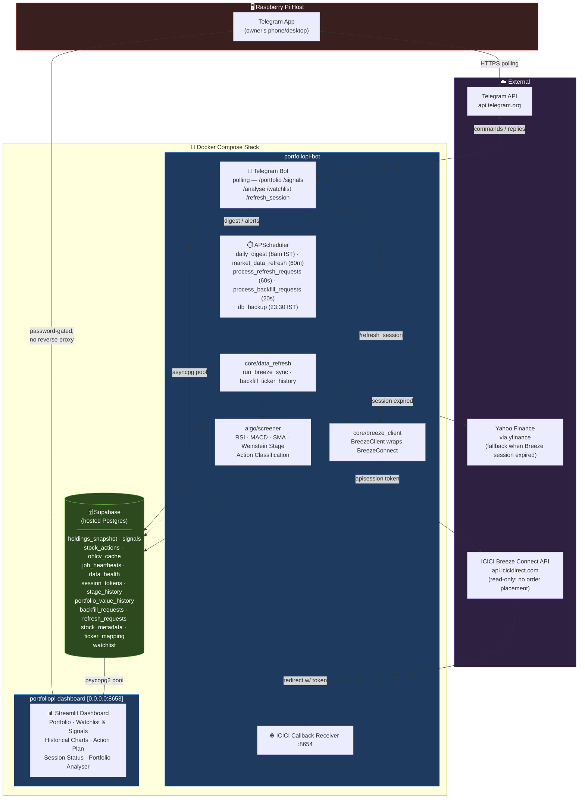

# PortfolioPi

A Streamlit dashboard, algorithmic screener, and Telegram bot for your ICICI Direct stock portfolio. **Read-only by design** — PortfolioPi strictly analyzes data and will never place, modify, or cancel orders.

## Architecture & Data Flow



Both the bot and dashboard connect directly to a hosted Supabase Postgres instance (not a local file) — `asyncpg` on the bot side, `psycopg2` on the dashboard side. This means the database is reachable and editable from anywhere, not just from the Pi. Unlike OverwatcherPI, the dashboard is exposed on `0.0.0.0:8653` directly (password-gated) rather than behind a reverse proxy.

## Setup & Deployment

1. **Clone the repo**
   ```bash
   git clone https://github.com/AbhiPra24/PortfolioPi.git
   cd PortfolioPi
   ```

2. **Environment Variables**
   Copy the example environment file and fill in your details:
   ```bash
   cp .env.example .env
   # Edit .env with your favorite editor
   ```
   **Important:** `TELEGRAM_OWNER_IDS` should be your numeric Telegram User ID. `DASHBOARD_PASSWORD` is required for dashboard access.

3. **Deploy with Docker**
   Start the services in detached mode:
   ```bash
   docker compose up --build -d
   ```
   *To persist on reboot on a Raspberry Pi, the containers are set to `restart: unless-stopped`. Ensure the Docker daemon is enabled in systemd (`sudo systemctl enable docker`).*

   **Bind-Mount Development Workflow**:
   The source directories (`core/`, `bot/`, `algo/`, `dashboard/`, `scripts/`) are bind-mounted inside the containers. For standard Python code updates (non-dependency changes), you do **not** need to rebuild the images. Simply pull the changes and restart the containers:
   ```bash
   docker compose restart bot dashboard
   ```
   The Streamlit dashboard will hot-reload automatically, while the Telegram bot needs a quick restart to apply changes. A full rebuild (`docker compose up --build -d`) is only needed when modifying packages or Dockerfiles.

## Daily Session Flow

ICICI Breeze requires a daily manual login to generate a session token:
1. Visit `https://api.icicidirect.com/apiuser/login?api_key=YOUR_API_KEY` in your browser.
2. Log in and copy the `apisession` token from the resulting URL.
3. Send this to the bot on Telegram: `/refresh_session <TOKEN>`.

## Bot Commands

- `/start` - Welcome message and command list.
- `/menu` - Show interactive button-based menu for quick navigation.
- `/portfolio` - View your current portfolio P&L summary.
- `/signals` - View the top algorithmic signals from your holdings and watchlist.
- `/analyse <TICKER>` - View full technical indicators, current price, and action plan verdict for a stock.
- `/action_plan` - View the structural buy/hold/trim/sell guidance from the Action Classification engine.
- `/watchlist add <TICKER>` - Add a stock to your watchlist.
- `/watchlist remove <TICKER>` - Remove a stock.
- `/watchlist list` - View current watchlist.
- `/price <TICKER>` - Get a live quote.
- `/funds` - View available funds/margin.
- `/status` - Check session token freshness, system health, and data health failures.
- `/refresh_session <TOKEN>` - Update the daily Breeze API session token (starts background refresh).

## Dashboard Pages

The local Streamlit dashboard (accessible at `http://<pi-ip>:8653` with the password from your `.env` file) offers 6 specialized views:

1. **Portfolio**: A high-level view of your current ICICI Direct holdings, P&L metrics, and an asset allocation pie/treemap chart. Supports auto-refresh (15s/30s/60s) and custom sorting.
2. **Watchlist & Signals**: A tactical short-term screener checking for RSI/MACD setups, SMA golden crosses, and volume spikes. Also includes action plan verdicts and a UI to manage your watchlist.
3. **Historical Charts**: Interactive candlestick charts for any ticker in your database, complete with volume, 50/200-day SMAs, RSI, MACD sub-panels, and Weinstein Stage colored background overlays.
4. **Action Plan**: The structural portfolio classification engine. Categorizes stocks based on Stage, Trend Template, and Relative Strength to offer long-term holding guidance.
5. **Session Status**: Check token freshness, log in to ICICI, monitor the `job_heartbeats` table, and track the `data_health` failure log.
6. **Portfolio Analyser**: Displays concentration risk (top 5 holdings %), portfolio-wide Weinstein Stage health distribution, and 252-day correlation/beta vs the Nifty 50 index.

## Project Structure

- `algo/`: Technical indicators, backtesting logic, and the structural action classification engines. (See [docs/ALGO.md](docs/ALGO.md) for methodology details).
- `bot/`: Telegram bot handlers, formatters, and broadcasting logic.
- `core/`: Database access, API client (Breeze), and daily refresh scheduler. (See [docs/DATABASE.md](docs/DATABASE.md) for schema details).
- `dashboard/`: Streamlit UI components and multipage app routing.
- `scripts/`: Manual maintenance scripts for ad-hoc operations.

## Manual Maintenance Scripts

### `scripts/backfill_history.py`
The daily pipeline only fetches incremental data. If you add a new stock to your watchlist or need to seed a fresh database, run this script to deeply backfill 3 years of OHLCV history for all tickers in your database. 

Run it manually inside the bot container:
```bash
docker exec portfoliopi-bot python -m scripts.backfill_history
```
This script chunks requests into 90-day windows to respect API constraints and is safe to interrupt/resume. See [docs/OPERATIONS.md](docs/OPERATIONS.md) for full details on verifying the backfill.
